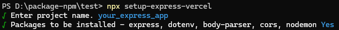
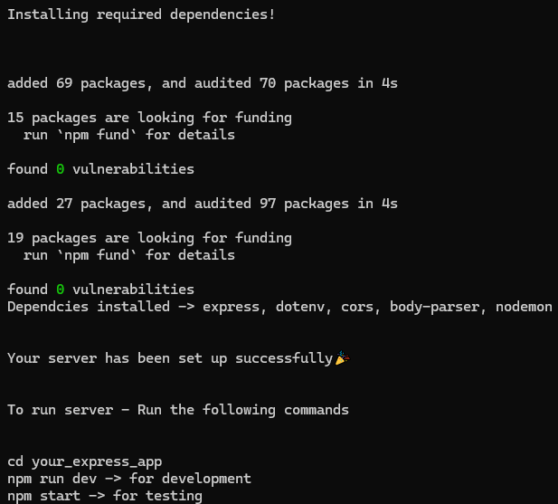

# setup-express-vercel

Setting up express app from scratch, when starting project can be simple but tedious if it has to be done multiple times.

I created this package to automate the setup of an Express.js server with Vercel deployment already provided, saving you from the hassle of setting up the app for deployment later.

## Installation

```bash
npm install setup-express-vercel
```

or preferred usage

```bash
npx setup-express-vercel
````

This will setup your express app, without installing the package into your device.

## Usage

Run the command in any terminal(**Powershell/cmd** in Windows or **bash** in Linux/Mac)



## Success



## Inputs

- Project Name - Your express project name Default - **express-app**
- Confirmation - Y/y for Yes(**default**) | N/n for No

## Installed Dependencies

- express
- dotenv
- body-parser
- cors
- nodemon

## Contributing

Contributions are welcome! Please follow these steps:

1. Fork the repository.
2. Create a new branch.
3. Make your changes.
4. Submit a pull request.

## License

This project is licensed under the [MIT License](LICENSE).